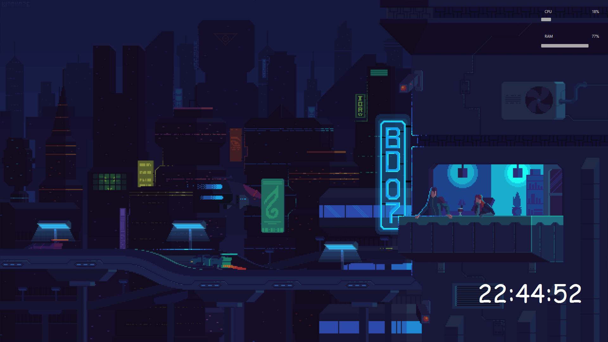

# Media-Server

> Projeto servidor para execução de media remotamente.

### Ajustes e melhorias

O projeto ainda está em desenvolvimento e as próximas atualizações serão voltadas nas seguintes tarefas:

- [ ] Implementação da funcionalidade de navegação remota
- [ ] Implementação na funcionalidade de compartilhamento de tela
- [ ] Implementação de recursos locais(bluetooth,disco)

## 💻 Pré-requisitos

Antes de começar, verifique se você atendeu aos seguintes requisitos:
* Você instalou a versão mais recente de `<Java / Javafx>`
* Você tem uma máquina `<Windows>`.

[⬆ Voltar ao topo](#nome-do-projeto) 

